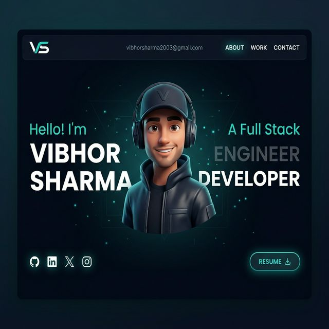

# Vibhor Sharma — Portfolio Website 🚀

A modern and interactive portfolio website showcasing my work as a Full Stack Developer and DevOps Intern. Built with a focus on performance, scalability, and immersive user experience.



---

## 🛠️ Tech Stack

**Frontend**
- React 18, TypeScript, Vite
- GSAP (animations), Three.js / WebGL
- @react-three/fiber, @react-three/rapier, @react-three/drei

**Backend & Development**
- Node.js, Express.js
- MongoDB

**Cloud & DevOps**
- AWS (EC2, S3, RDS, IAM)
- Docker, CI/CD basics
- Linux, Git & GitHub

---

## 💼 Projects Featured

| Project | Description |
|---|---|
| School For Training | Developed backend, authentication, and admin/manager panel |
| Datricle | Worked on full stack (frontend + backend) development |
| Lonestar Innovation AI | Built backend services and admin panel |
| E-Commerce Developer Store | Personal project (in progress) |
| CRM for MLM Companies | Personal project (in progress) |

---

## ✨ Features

- Interactive UI with smooth animations (GSAP)
- 3D Tech Stack visualization using Three.js
- Responsive and modern design
- Real-world production projects showcase
- Optimized performance and clean architecture

---

## ⚙️ Getting Started

### Prerequisites
- Node.js >= 18
- npm or yarn

### Installation

```bash
git clone https://github.com/YOUR_USERNAME/YOUR_REPO_NAME.git
cd YOUR_REPO_NAME

npm install
npm run dev